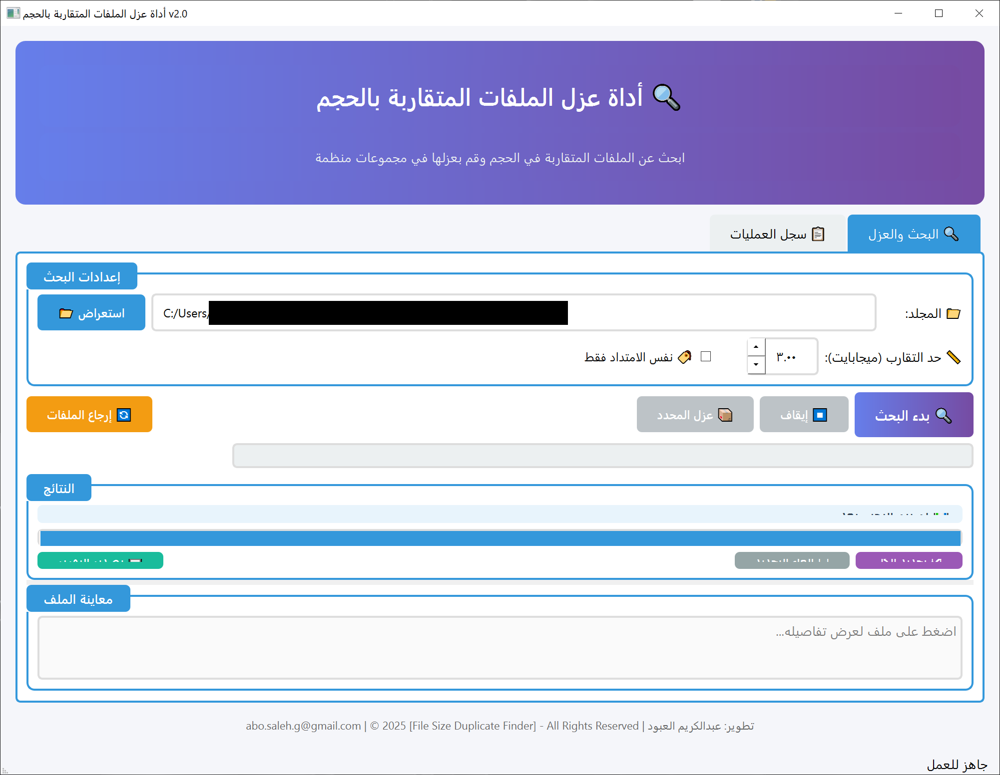
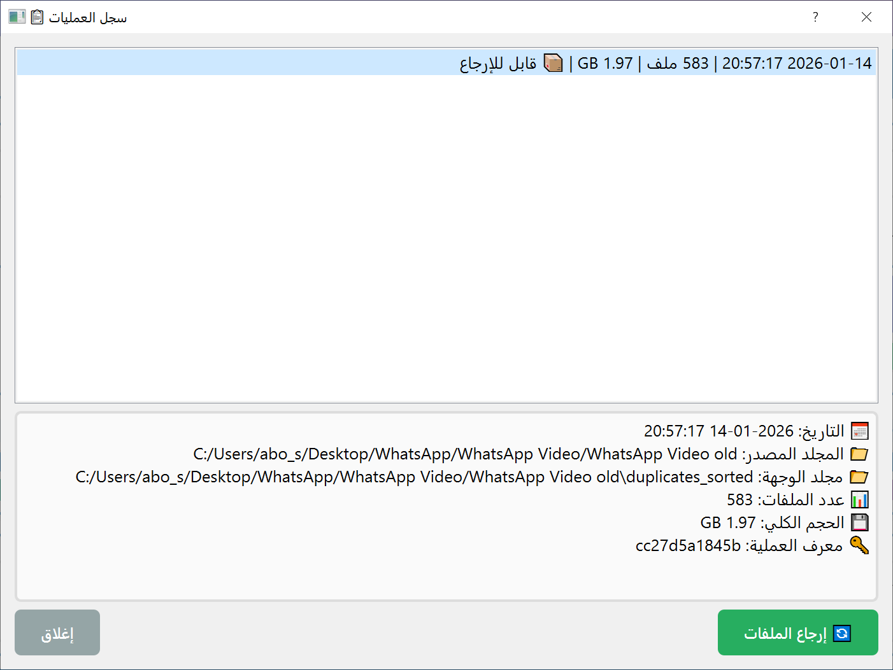

<div align="center">

# 🔍 أداة لعزل الملفات المتقاربة بالحجم
## File Size Duplicate Finder


**أداة متقدمة للبحث عن الملفات المتقاربة في الحجم وعزلها في مجموعات منظمة**

[العربية](#العربية) | [English](#english)

</div>

---

# العربية

## 📖 نظرة عامة

أداة عزل الملفات المتقاربة بالحجم هي تطبيق سطح مكتب مبني بـ PyQt5 يساعدك في العثور على الملفات التي لها أحجام متقاربة وتنظيمها في مجموعات. هذا مفيد بشكل خاص لـ:

- 🔎 اكتشاف الملفات المكررة المحتملة
- 🧹 تنظيف المساحة التخزينية
- 📁 تنظيم الملفات في مجموعات

## 📸 لقطات الشاشة

<div align="center">

| الواجهة الرئيسية | نتائج البحث |
|:---:|:---:|
|  |  |

</div>

## ✨ المميزات

| الميزة | الوصف |
|--------|-------|
| 🔍 **بحث متقدم** | البحث عن الملفات المتقاربة في الحجم بناءً على حد تقارب قابل للتعديل |
| 📦 **عزل تلقائي** | نقل الملفات المحددة إلى مجلدات منظمة تلقائياً |
| 🔄 **إرجاع الملفات** | إمكانية إرجاع الملفات إلى مواقعها الأصلية حتى بعد إغلاق البرنامج |
| 📊 **إحصائيات تفصيلية** | عرض عدد الملفات، الحجم الكلي، والتوفير المحتمل |
| 🔎 **معاينة سريعة** | عرض تفاصيل الملف (تاريخ الإنشاء، التعديل، المسار) |
| 📁 **فتح موقع الملف** | الوصول السريع لموقع أي ملف في مستكشف الملفات |
| 💾 **تصدير التقارير** | حفظ النتائج بصيغة TXT أو CSV |
| 🎨 **تلوين المجموعات** | ألوان مميزة لكل مجموعة لسهولة التمييز |
| ⚙️ **حفظ الإعدادات** | تذكر آخر مجلد والإعدادات المستخدمة |
| 🔔 **إشعارات صوتية** | تنبيه عند انتهاء العمليات |
| 📋 **سجل العمليات** | تتبع جميع العمليات التي تمت |
| 📺 **دعم الشاشات عالية الدقة** | واجهة واضحة على جميع الشاشات |
| 🏷️ **فلترة بالامتداد** | البحث في ملفات بنفس الامتداد فقط |

## 💻 متطلبات التشغيل

- Python 3.7 أو أحدث
- PyQt5

## 🚀 التثبيت

### 1. استنساخ المشروع
```bash
git clone https://github.com/abosalehg-ui/File-Size-Duplicate-Finder.git
cd File-Size-Duplicate-Finder
```

### 2. تثبيت المتطلبات
```bash
pip install PyQt5
```

### 3. تشغيل التطبيق
```bash
python file_size_duplicate_finder_pyqt5.py
```

## 📖 طريقة الاستخدام

### البحث عن الملفات المتقاربة
1. اضغط على **"استعراض"** لاختيار المجلد المراد فحصه
2. حدد **حد التقارب** بالميجابايت (مثال: 3 ميجابايت يعني الملفات التي فرق حجمها أقل من 3 ميجابايت)
3. اختر **"نفس الامتداد فقط"** إذا أردت البحث في ملفات من نفس النوع
4. اضغط **"🔍 بدء البحث"**

### عزل الملفات
1. حدد الملفات التي تريد عزلها بالنقر على مربع التحديد ☐
2. أو استخدم **"☑ تحديد الكل"**
3. اضغط **"📦 عزل المحدد"**
4. سيتم نقل الملفات إلى مجلد `duplicates_sorted` داخل المجلد المحدد

### إرجاع الملفات
1. اضغط **"🔄 إرجاع الملفات"**
2. اختر العملية التي تريد التراجع عنها
3. اضغط **"إرجاع"** لإعادة الملفات لمواقعها الأصلية

## 📁 هيكل المشروع

```
File-Size-Duplicate-Finder/
├── file_size_duplicate_finder_pyqt5.py    # الملف الرئيسي
├── README.md                               # هذا الملف
├── screenshot1.png                         # لقطة شاشة 1
└── screenshot2.png                         # لقطة شاشة 2
```

## 📄 ملفات البيانات

يقوم التطبيق بإنشاء الملفات التالية في مجلد المستخدم:
- `file_finder_history.json` - سجل عمليات النقل والإرجاع
- إعدادات التطبيق تُحفظ في سجل النظام (QSettings)

---

# English

## 📖 Overview

File Size Duplicate Finder is a desktop application built with PyQt5 that helps you find files with similar sizes and organize them into groups. This is particularly useful for:

- 🔎 Detecting potential duplicate files
- 🧹 Cleaning up storage space
- 📁 Organizing files into groups

## ✨ Features

- 🔍 **Advanced Search** - Find files with similar sizes based on adjustable threshold
- 📦 **Auto Organization** - Move selected files to organized folders automatically
- 🔄 **File Restore** - Restore files to original locations even after closing the app
- 📊 **Detailed Statistics** - View file count, total size, and potential savings
- 🔎 **Quick Preview** - Display file details (creation date, modification, path)
- 📁 **Open File Location** - Quick access to any file location in file explorer
- 💾 **Export Reports** - Save results as TXT or CSV
- 🎨 **Color-coded Groups** - Distinct colors for each group
- ⚙️ **Save Settings** - Remember last folder and settings
- 🔔 **Sound Notifications** - Alert when operations complete
- 📋 **Operation Log** - Track all operations
- 📺 **High DPI Support** - Clear interface on all screens
- 🏷️ **Extension Filter** - Search only files with same extension

## 💻 Requirements

- Python 3.7+
- PyQt5

## 🚀 Installation

```bash
# Clone the repository
git clone https://github.com/abosalehg-ui/File-Size-Duplicate-Finder.git
cd File-Size-Duplicate-Finder

# Install dependencies
pip install PyQt5

# Run the application
python file_size_duplicate_finder_pyqt5.py
```

## 📖 Usage

1. Click **"Browse"** to select the folder to scan
2. Set the **size threshold** in MB
3. Optionally check **"Same extension only"**
4. Click **"🔍 Start Search"**
5. Select files to isolate
6. Click **"📦 Isolate Selected"**

---

<div align="center">

## 👨‍💻 المطور | Developer

**عبدالكريم العبود | Abdulkarim Alaboud**

📧 [abo.saleh.g@gmail.com](mailto:abo.saleh.g@gmail.com)

---

## 📜 حقوق الملكية | Copyright

© 2025 **File Size Duplicate Finder** - All Rights Reserved

تم التطوير بـ ❤️ باستخدام Python و PyQt5

</div>
