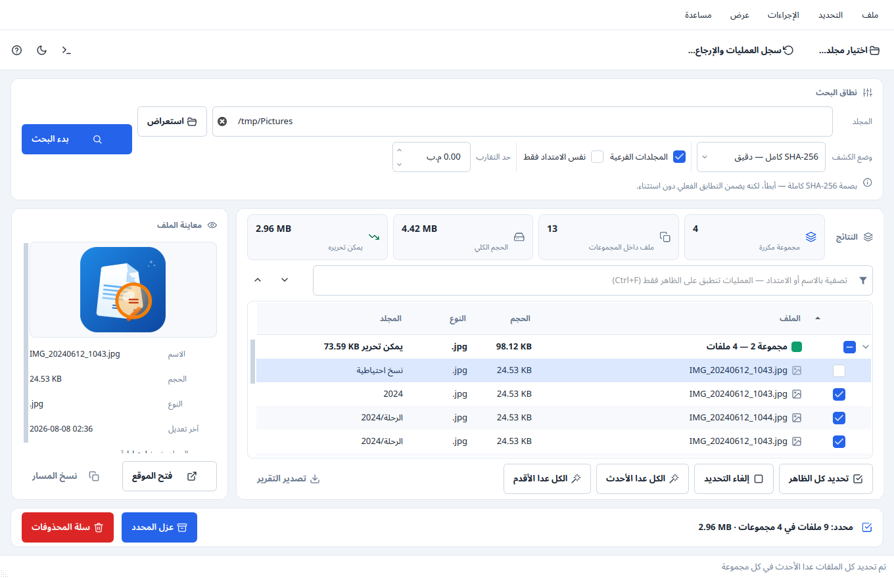
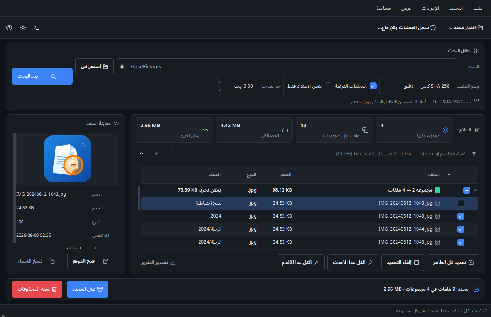
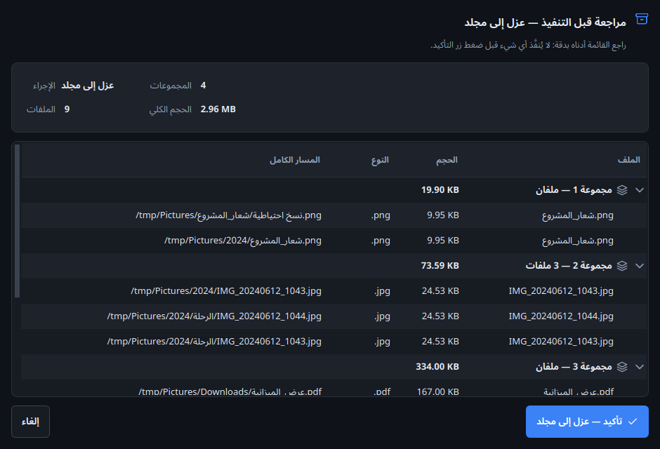

<div align="center">


# 🔍 أداة لعزل الملفات المتقاربة بالحجم
## File Size Duplicate Finder


**أداة متقدمة للبحث عن الملفات المكررة وعزلها — كشف بالحجم أو بالـ Hash المتوازي، محرك موحد للواجهة والـ CLI، وواجهة أُعيد تصميمها بنظام تصميم موحّد**

[العربية](#العربية) | [English](#english)

</div>

---

# العربية

## 📖 نظرة عامة

**أداة عزل الملفات المتقاربة بالحجم** تطبيق سطح مكتب مبني بـ PyQt5 مع واجهة سطر أوامر مستقلة، يساعدك على:

- 🔎 اكتشاف الملفات المكررة بثلاثة أوضاع (حجم / Partial hash / SHA-256 كامل)
- 🌳 مسح أشجار عميقة تضم مئات آلاف الملفات بكفاءة (تجزئة متوازية + كاش SQLite)
- 🗑️ نقل الملفات إلى سلة المحذوفات أو مجلد منظّم — مع معاينة إجبارية وحارس "الاحتفاظ بنسخة"
- 🔄 استرداد أي عملية حتى بعد إغلاق التطبيق (مع دعم الاسترداد الجزئي)

## 📸 لقطات الشاشة

<div align="center">

**الوضع الفاتح — النتائج ولوحة المعاينة**



**الوضع الداكن — نفس الشاشة بعد «تحديد الكل عدا الأحدث»**



**المعاينة الإجبارية قبل أي عملية**



</div>

## ✨ المميزات الكاملة

### 🔍 محرّك البحث
| الميزة | الوصف |
|--------|-------|
| **3 أوضاع كشف** | حجم متقارب (سريع) • Partial hash (متوازن، بداية+نهاية الملف) • SHA-256 كامل (دقيق 100%) |
| **🆕 محرك موحد** | نفس المحرك (`finder/core`) للواجهة والـ CLI — نتائج متطابقة دائماً |
| **🆕 تجزئة متوازية** | ThreadPoolExecutor — تسريع 2-4× على SSD/NVMe |
| **🆕 كاش SQLite** | كتابة ذرّية، مصمم لمئات آلاف الملفات، إبطال تلقائي عند تعديل الملف، ترحيل تلقائي من الكاش القديم |
| **بحث متداخل** | مسح المجلدات الفرعية مع تجاهل `.git` و `node_modules` و `venv`... |
| **خوارزمية O(n log n)** | نافذة منزلقة (sliding window) للتجميع بالحجم |
| **فلترة بالامتداد** | البحث في ملفات بنفس الامتداد فقط |
| **حد تقارب من 0** | 0 = تطابق حجم دقيق (الافتراضي)، أو أي قيمة بالميجابايت |

### 🛡️ ميزات الأمان
| الميزة | الوصف |
|--------|-------|
| **معاينة العملية (Dry-run)** | جدول تفصيلي قبل النقل/الحذف — تأكيد إجباري |
| **🆕 حارس الاحتفاظ بنسخة** | تحديد كل ملفات مجموعة يتطلب إقراراً صريحاً إضافياً |
| **🆕 تحديد ذكي** | «الكل عدا الأحدث» / «الكل عدا الأقدم» — تبقى نسخة دائماً |
| **🆕 سجل نوايا** | العملية تُسجّل قبل التنفيذ — الانقطاع لا يُضيع السجل |
| **🆕 استرداد جزئي** | فشل إرجاع بعض الملفات لا يقفل العملية — أعد المحاولة على المتبقي |
| **🆕 إيقاف فوري** | زر الإيقاف يستجيب خلال أجزاء من الثانية حتى أثناء تجزئة ملف ضخم |
| **سلة المحذوفات** | إرسال إلى سلة النظام (قابلة للاسترداد) عبر send2trash |
| **نسخ احتياطية دوّارة** | آخر 10 نسخ من السجل في `~/.history_backup/` |
| **تنبيه للعمليات الكبيرة** | يحذّر عند تجاوز 100 ملف أو 1GB |
| **معالجة تصادم الأسماء** | إعادة تسمية تلقائية عند وجود ملف بنفس الاسم |

### 🎨 الواجهة (UX) — أُعيد تصميمها في 4.1
| الميزة | الوصف |
|--------|-------|
| **🆕 نظام تصميم موحّد** | رموز ألوان ومقاسات واحدة (`gui/theme.py`) تبني الوضعين الفاتح والداكن — لا لون مكتوب داخل منطق الواجهة |
| **🆕 أيقونات متجهة** | طقم SVG أحادي السماكة يُلوَّن من الثيم (`gui/icons.py`) بدل الإيموجي المختلفة بين المنصات |
| **🆕 ثلاث مناطق واضحة** | نطاق البحث ← النتائج ← شريط إجراءات سفلي، وإجراء أساسي واحد يتحول إلى «إيقاف» أثناء العمل |
| **🆕 شريط قوائم واختصارات** | كل إجراء في مكان واحد مع اختصار لوحة مفاتيح، ودليل استخدام (F1) |
| **🆕 شريط إجراءات ذكي** | يعرض حجم وعدد المحدد، ويبقى معطّلاً حتى يوجد تحديد فعلي، ويحذّر لحظة تحديد مجموعة بالكامل |
| **🆕 لوحة معاينة جانبية** | تفاصيل مرتبة + thumbnail + «فتح الموقع» و«نسخ المسار» — والشجرة صارت الأوسع |
| **🆕 عمود المجلد وترتيب بالأعمدة** | تعرف مصدر كل نسخة فوراً، والحجم يُرتَّب رقمياً لا أبجدياً |
| **🆕 حالات فارغة موصوفة** | قبل البحث / لا نتائج / لا مطابقات للفلتر — كل واحدة بتلميحها |
| **🆕 سجل النشاط لوحة سفلية** | Ctrl+L — رؤية السجل لم تعد تُخفي النتائج |
| **🆕 صياغة عربية سليمة** | «ملفان» و«15 ملفاً» بدل «1 ملفات»، وعزل اتجاهي للمسارات والأحجام |
| **السحب والإفلات** | اسحب أي مجلد على النافذة لتعيينه كمسار البحث |
| **الوضع الداكن** | يُحفظ بين الجلسات، ويشمل ما يرسمه Qt نفسه عبر `QPalette` |
| **شريط فلتر مباشر** | اكتب لتصفية النتائج فورياً — العمليات تشمل الظاهر فقط (WYSIWYG) |
| **Checkboxes حقيقية** | تحديد قياسي مع حالة جزئية للمجموعات — أفضل وصولاً |
| **شاشات عالية الدقة** | High-DPI scaling تلقائي |

### 💻 واجهة سطر الأوامر (CLI)

تستخدم نفس المحرك، بلا PyQt5 — مناسبة للسكربتات والمهام المجدولة:

```bash
# بحث أساسي (تطابق حجم دقيق افتراضياً)
file-finder --scan /path/to/folder

# بحث متداخل بـ SHA-256 وتصدير CSV مع استثناء مجلدات
file-finder --scan /data --recursive --mode full --exclude Backups --output report.csv

# أتمتة صامتة بمخرجات JSON
file-finder --scan /data --recursive --mode partial --output result.json --quiet
```

| المعامل | الوصف |
|---------|-------|
| `--scan PATH` | (مطلوب) مسار المجلد |
| `--threshold MB` | حد التقارب بالميجابايت (افتراضي 0 = تطابق دقيق) |
| `--recursive` | بحث متداخل |
| `--same-ext` | نفس الامتداد فقط |
| `--mode size\|partial\|full` | وضع الكشف |
| `--exclude DIR` | استثناء مجلد إضافي (يقبل التكرار) |
| `--workers N` | عدد خيوط التجزئة (افتراضي: تلقائي) |
| `--no-cache` | تعطيل كاش الـ hash |
| `--output FILE` | الصيغة من الامتداد: `.csv` / `.json` / `.txt` |
| `--quiet` / `--verbose` | تحكم في الإخراج |

**أكواد الخروج** (للأتمتة): `0` = وُجدت مجموعات • `1` = لا نتائج • `2` = خطأ استخدام • `130` = إلغاء

## 💻 متطلبات التشغيل

- Python 3.9+
- للواجهة الرسومية: PyQt5 5.15+ و send2trash (اختياري لسلة المحذوفات)
- الـ CLI بلا أي تبعيات خارجية

## 🚀 التثبيت والتشغيل

```bash
git clone https://github.com/abosalehg-ui/File-Size-Duplicate-Finder.git
cd File-Size-Duplicate-Finder

# تثبيت كحزمة (يوفر أمرَي file-finder و file-finder-gui)
pip install -e ".[gui]"

file-finder-gui                 # الواجهة الرسومية
file-finder --scan /path        # سطر الأوامر

# أو تشغيل مباشر دون تثبيت
pip install -r requirements.txt
python file_size_duplicate_finder.py
python file_finder_cli.py --scan /path
```

### بناء تنفيذي مستقل (PyInstaller)

```bash
pip install pyinstaller
pyinstaller build.spec --clean
# الناتج: dist/FileSizeDuplicateFinder(.exe)
```

تُبنى التنفيذيات للمنصات الثلاث تلقائياً عبر GitHub Actions عند دفع tag يبدأ بـ `v`.

## 🧪 التطوير

```bash
pip install -e ".[dev]"
ruff check finder tests        # الفحص الثابت
pytest                         # 80 اختباراً للمحرك والعمليات والـ CLI والواجهة
```

يعمل الفحص والاختبار تلقائياً على كل push عبر GitHub Actions.

## 📁 هيكل المشروع

```
File-Size-Duplicate-Finder/
├── finder/                          # الحزمة الرئيسية
│   ├── core/                        # المحرك النقي (بلا Qt)
│   │   ├── scan.py                  #   مسح المجلدات
│   │   ├── grouping.py              #   النافذة المنزلقة
│   │   ├── hashing.py               #   تجزئة متوازية + إلغاء فوري
│   │   ├── cache.py                 #   كاش SQLite
│   │   └── reports.py               #   TXT / CSV / JSON
│   ├── ops/                         # العمليات (بلا Qt)
│   │   ├── operations.py            #   نقل / سلة / استرجاع
│   │   └── history.py               #   سجل نوايا + نسخ احتياطية
│   ├── gui/                         # الواجهة الرسومية (PyQt5)
│   │   ├── main_window.py           #   ترتيب الواجهة والإجراءات
│   │   ├── theme.py                 #   رموز التصميم + QSS + QPalette
│   │   ├── icons.py                 #   طقم أيقونات SVG متوافق مع الثيم
│   │   ├── widgets.py               #   بطاقات ورقائق وحالات فارغة
│   │   ├── textfmt.py               #   صياغة الأعداد وعزل اتجاه النصوص
│   │   ├── selection.py             #   منطق التحديد (نقي، بلا Qt)
│   │   ├── dialogs.py               #   المعاينة + السجل + الدليل
│   │   └── workers.py               #   خيط عامل موحد
│   └── cli.py                       # واجهة سطر الأوامر
├── tests/                           # اختبارات pytest
├── .github/workflows/               # CI + بناء التنفيذيات
├── file_size_duplicate_finder.py    # نقطة دخول متوافقة (GUI)
├── file_finder_cli.py               # نقطة دخول متوافقة (CLI)
├── build.spec                       # PyInstaller
├── pyproject.toml
└── assets/ · screenshots/
```

## 📄 ملفات البيانات

- `~/file_finder_history.json` — سجل العمليات (نسخ احتياطية في `~/.history_backup/`)
- `~/.file_finder_hash_cache.sqlite3` — كاش الـ hash (يرحّل الكاش القديم `.json` تلقائياً)
- `QSettings` — الإعدادات (آخر مجلد، الحد، الوضع الداكن...)

## 🛣️ خارطة الطريق

تم تنفيذه ✅:
- ~~إعادة هيكلة الكود إلى حزمة Python~~ (4.0)
- ~~اختبارات + CI~~ (4.0)
- ~~تجزئة متوازية وكاش SQLite~~ (4.0)
- ~~حارس الاحتفاظ بنسخة + التحديد الذكي~~ (4.0)
- ~~بناء التنفيذيات تلقائياً عبر GitHub Actions~~ (4.0)
- ~~إعادة تصميم الواجهة: نظام تصميم موحّد وأيقونات متجهة وترتيب يتبع تدفّق العمل~~ (4.1)

قيد التخطيط:
- نظام ترجمة كامل (i18n) مع تبديل اللغة من القائمة
- مقارنة بين مجلدين
- إحصائيات مرئية (رسوم بيانية لتوزيع الأحجام)

---

# English

## 📖 Overview

**File Size Duplicate Finder** (v4.1) is a PyQt5 desktop app + standalone CLI for finding and isolating duplicate files. One shared engine (`finder/core`) powers both interfaces: three detection modes (size / partial hash / full SHA-256), parallel hashing, an SQLite hash cache built for hundreds of thousands of files, and a full safety net (dry-run preview, keep-one guard, recycle bin, intent-logged operations, partial restore).

## ✨ Key Features

- 🔍 **Three detection modes**: size threshold • partial hash (head+tail MD5) • full SHA-256
- ⚡ **Parallel hashing** (2–4× faster on SSDs) with **instant cancellation**
- 💾 **SQLite hash cache** — atomic, scales to huge folders, auto-invalidates on file change
- 🧠 **Smart selection**: select all but newest/oldest per group — a copy always survives
- 🛑 **Keep-one guard**: selecting every file of a group requires explicit acknowledgment
- 📝 **Intent log**: operations are journaled before execution; interruptions are detected
- 🔄 **Partial restore**: failed restores stay retryable for the remaining files
- 🎨 **Redesigned UI (4.1)**: single design-token system driving both light and dark themes, a consistent vector icon set (no emoji), menu bar with full keyboard coverage, selection-aware action bar, side preview panel, sortable columns with a folder column, described empty states, and correct Arabic pluralisation with bidi isolation
- 🖱️ Drag & drop, live filter (WYSIWYG operations), image thumbnails, High-DPI, persisted window/layout state
- 💻 **CLI** with documented exit codes (0 found / 1 none / 2 usage / 130 cancelled), `--exclude`, `--workers`, JSON/CSV/TXT export

## 🚀 Installation

```bash
git clone https://github.com/abosalehg-ui/File-Size-Duplicate-Finder.git
cd File-Size-Duplicate-Finder
pip install -e ".[gui]"

file-finder-gui                  # GUI
file-finder --scan /data --recursive --mode full --output report.csv
```

## 🧪 Development

```bash
pip install -e ".[dev]"
ruff check finder tests && pytest
```

CI (lint + 80 tests) runs on every push; tagged releases build executables for Windows/Linux/macOS via GitHub Actions.

---

<div align="center">

## 👨‍💻 المطور | Developer

**عبدالكريم العبود | Abdulkarim Alaboud**

📧 [abo.saleh.g@gmail.com](mailto:abo.saleh.g@gmail.com)

---

## 📜 الرخصة | License

هذا المشروع مفتوح المصدر تحت رخصة [MIT](LICENSE)

Released under the [MIT License](LICENSE) — © 2025 Abdulkarim Alaboud

تم التطوير بـ ❤️ باستخدام Python و PyQt5

</div>
